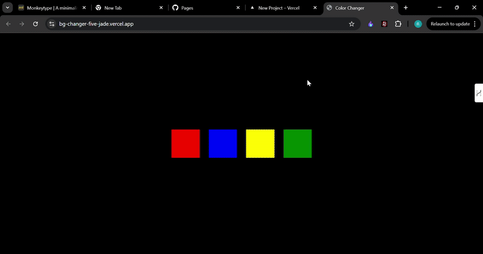

Background Color Changer

A simple web app that changes the background color dynamically using JavaScript.

🚀 Features

🎨 Click a button to change the background color.

🌈 Generates random colors.

⚡ Lightweight and easy to use.

🛠 How to Use

📂 Open index.html in a browser.

🖱️ Click the button to change the background color.

🏗 Technologies Used

🏷 HTML

🎨 CSS

⚙ JavaScript

## 🎥 Demo
